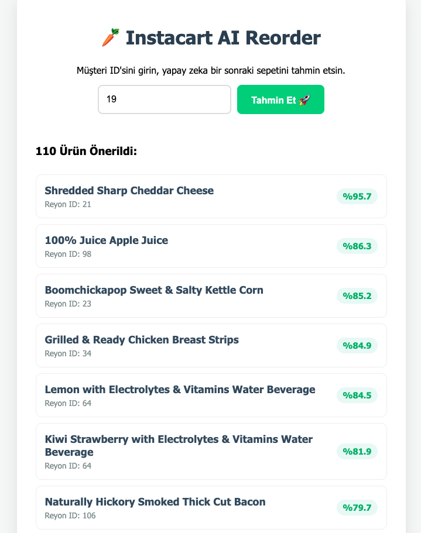

# 🥕 Instacat Market Basket Prediction & Reorder System


**BU PROJE UÇTAN UCA BİR MAKİNE ÖĞRENMESİ VE YAZILIM MİMARİSİ ÇALIŞMASIDIR**

Proje, Instacart (Online Market) müşterilerinin geçmiş 3 milyon+ sipariş verisini analiz ederek, bir sonraki alışverişlerinde hangi ürünleri **tekrar satın alacaklarını (reorder)** tahmin eden gelişmiş bir yapay zeka uygulamasıdır.

Sadece bir Jupyter Notebook analizi değil; **Backend (Flask API)**, **Frontend (Responsive UI)**, **Veri Tabanı (SQLite)** ve **Yapay Zeka (XGBoost)** katmanlarının entegre çalıştığı, **Dockerize** edilmiş canlı bir üründür.

## 🌐 Özellikler

### 🚀 Model Geliştirme Süreci (Engineering Journey)

Projenin başarısı, model parametrelerinden ziyade **Veri ve Özellik Mühendisliğine (Feature Engineering)** dayanmaktadır. Geliştirme süreci şu aşamalarla ilerlemiştir:

1. **Temel Atma (Baseline):** XGBoost modeli kuruldu.
2. **Hiperparametre Optimizasyonu:** `Grid Search` ve `Bayesian Optimization` teknikleri uygulandı. Ancak skorlarda anlamlı bir değişim gözlenmedi.
3. **Karar (Pivot):** Modelin parametrelerini zorlamak yerine, modele "daha zeki veriler" sunulmasına karar verildi (Data-Centric AI).
4. **Hata Analizi (Error Analysis):** Confusion Matrix incelenerek modelin nerede yanıldığı (False Positive/Negative) tespit edildi ve özellikler buna göre revize edildi.

### 🧠 Özellik Mühendisliği (The "Brain" of the Model)

Modelin karar mekanizmasını güçlendirmek için 3 ana kategoride derinlemesine özellikler türetilmiştir:

#### 1. 👥 KULLANICI ÖZELLİKLERİ (User Persona)

*Bu kullanıcı kimdir ve alışveriş alışkanlıkları nasıldır?*

* **`user_total_orders` (Tecrübe):** Toplam sipariş sayısı. (Eski kurt mu, yeni müşteri mi?)
* **`user_avg_days_between` (Sıklık):** Marketi ne sıklıkla ziyaret ediyor?
* **`user_avg_basket_size` (Hacim):** Tek seferde ortalama kaç ürün alıyor?
  > *Mühendislik Yorumu:* Sepeti büyük olanın (40 ürün), küçük olana (5 ürün) göre bir ürünü tekrar alma ihtimali ve toleransı farklıdır.
  >

#### 2. 🍱 ÜRÜN ÖZELLİKLERİ (Item Character)

*Bu ürünün doğası nedir?*

* **`prod_total_orders` (Popülerlik):** Market genelinde ne kadar satıyor?
* **`prod_reorder_rate` (Bağımlılık):** Alanlar tekrar alıyor mu?
* **`prod_avg_position` (Aciliyet):** İnsanlar bunu sepete kaçıncı sırada atıyor?
  > *Mühendislik Yorumu:* Süt genelde 1. sırada atılır (İhtiyaç). Sakız 20. sırada atılır (Keyfi). Bu ayrım model için kritiktir.
  >

#### 3. 🫔 KULLANICI - ÜRÜN İLİŞKİSİ (UxP - En Kritik Bölüm)

*Ahmet ile Muz arasındaki ilişki nasıl?*

* **`uxp_total_bought` (Sadakat):** Kullanıcı bu ürünü kaç kez aldı?
* **`uxp_reorder_ratio` (Alışkanlık):** Tekrar etme oranı nedir?
* **`uxp_avg_position` (Kişisel Önem):**
  > *Senaryo:* Herkes sakızı sona atar ama Ahmet en başa atıyorsa, Ahmet sakız bağımlısıdır. Model bunu yakalar.
  >
* **`uxp_last_order_number` (Hafıza & Recency):** Ürünü en son kaçıncı siparişinde aldı? "Kaç sipariştir almıyor?" bilgisini üretmek için kullanılır.

#### 4. ⏳ BAĞLAM VE ZAMAN (Context & Trend)

* **Zaman Döngüselliği (Cyclical Encoding):** Saat verisi (0-23) lineer değil, döngüseldir (23 ile 0 yakındır). Bu nedenle Sinüs/Kosinüs dönüşümleri uygulanarak modele zaman kavramı öğretildi.
* **Departman Bağlamı:** Ürün ID'leri (örn: 24852) departman bilgisiyle zenginleştirildi.
  > *Mantık:* "Ahmet %60 Manav reyonundan alışveriş yapıyor. Şu anki aday ürün de Manav reyonunda. O zaman bunu sevme ihtimali yüksek."
  >
* **Trend Analizi:** Kullanıcının son davranışlarına odaklanıldı.
  > *Senaryo:* Ahmet eskiden sigara alıyordu (Genel ortalaması yüksek) ama son 10 sipariştir almıyor. Model, sadece genel ortalamaya değil son trende bakarak Ahmet'in sigarayı bıraktığını anlar ve önermez.
  >

## 🔬 Teknik Mimari ve Optimizasyon

### 📈 Python vs SQL

Karmaşık *Window Functions* ve *Trend Analizleri* (Örn: Son 5 siparişteki değişim) için SQL sorgularının karmaşıklığı yerine, veriler **Pandas** ile belleğe çekilip Python üzerinde işlenerek performans artışı sağlandı.

### 🧨 Dinamik Eşik Yönetimi (Dynamic Thresholding)

F1 Skorunu maksimize etmek için herkes için sabit bir baraj yerine, **Kişiye Özel Eşik** mantığı kurgulandı.

* *Mantık:* 20 ürün alan birine "+1 ürün" önermek ile 3 ürün alan birine önermek aynı riskte değildir. `user_avg_basket_size` ile korelasyon kurularak eşik değer dinamik hale getirildi.

### 🤖 Canlı Tahmin Akışı (Inference Pipeline)

1. **İstemci:** Tarayıcıdan `User ID` gönderir.
2. **Sunucu (Flask):** SQLite'dan kullanıcının geçmişini çeker.
3. **Transformasyon:** Geçmiş veriyi, modelin eğitimde gördüğü formata (Feature Engineering on-the-fly) dönüştürür.
4. **Tahmin:** XGBoost çalışır ve olasılıkları üretir.
5. **Filtre:** Eşik değerin altındakileri eler ve JSON döner.

### 🛠️ Mimari ve Teknolojiler

Proje, modern yazılım geliştirme prensiplerine uygun olarak **Modüler** ve **Konteynerize** yapıda geliştirilmiştir:

| Dosya                            | Görev                                                  | Kullanılan Teknolojiler                                 |
| :------------------------------- | :------------------------------------------------------ | :------------------------------------------------------- |
| **app.py**                 | API Gateway ve Arayüz Sunucusu                         | `Flask`, `Jinja2`, `Pandas`                        |
| **Dockerfile**             | Konteyner ve Ortam Sanallaştırma                      | `Docker`, `Linux (Python-Slim)`                      |
| **xgb_prod_final_v3.json** | Eğitilmiş AI Modeli (Serialized)                      | `XGBoost`                                              |
| **instacart.db**           | İşlenmiş Veri Deposu                                 | `SQLite3`, `SQL`                                     |
| **index.html**             | Kullanıcı Arayüzü (Frontend)                        | `HTML5`, `CSS3`, `JavaScript (Fetch API)`          |
| **model.py**               | Veri Analizi (EDA), Eğitim ve Görselleştirme         | `Matplotlib`, `Seaborn`, `Scikit-learn`, `NumPy` |
| **src/ (Data Pipeline)**   | ETL, Özellik Mühendisliği ve Veri Seti Hazırlığı | `Pandas`, `NumPy`, `SQL`, `ETL`                  |

## 📂 Proje Dizini

```bash
instacart-reorder-prediction/
├── app.py                 # Ana Uygulama (Flask & Inference Logic)
├── Dockerfile             # Docker Konfigürasyonu
├── requirements.txt       # Kütüphane Bağımlılıkları
├── xgb_prod_final_v3.json # Eğitilmiş XGBoost Modeli
├── .gitignore             # Git Hariç Tutma Listesi
├── README.md              # Proje Dokümantasyonu
├── data/
│   └── processed/
│       └── instacart.db     # SQLite Veritabanı (Özellikler & Loglar {İlk Çalıştırmadan Sonra Oluşacak})
│       └── train_data.csv   # Model İçin İşlenmiş Özellikler {İlk Çalıştırmadan Sonra Oluşacak})
├── templates/
│   └── index.html         # Web Arayüzü (HTML/CSS/JS)
└── images/                # README Ekran Görüntüleri
    ├── anasayfa.png
    ├── urunsorgu1.png
    └── urunsorgu2.png
└── notebooks/                # EDA ve Model Eğitim
    ├── EDA_sql.ipynb	      # Özellik ve Ön Keşif İşlemleri
    ├── model.ipynb 	      # Model Eğitim Süreç Açıklamaları (Kaggleda Eğitim Yapıldı Burada Sadece Açıklamalar Var)
└── src/  		      # Sistemi Oluşturan Bileşenler
    ├── __init__.py
    ├── create_dataset.py	# Oluşturulan Özelliklerin Veri Setine Dönüştürülmesi
    └── data_ingest.py		# Verilerin Sqlite'a Aktarılması
    └── features.py		# Özelliklerin Oluşturulması
└── config/  		# Arka Plan Ayarları
    ├── __init__.py
    ├── config.py
```

## ⚙️ Kurulum ve Çalıştırma

Proje **Docker** teknolojisi ile geliştirildiği için "Benim bilgisayarımda çalışıyordu" sorununu ortadan kaldırır. İki farklı yöntemle çalıştırabilirsiniz.

### Yöntem 1: 🐳  Deployment & Dockerization (ÖNERİLEN)

Proje, "Her yerde çalışır" prensibiyle Dockerize edilmiştir.

1. **Gereksinimler (`requirements.txt`):** Flask, XGBoost, Pandas gibi kütüphanelerin listesi çıkarıldı.
2. **Reçete (`Dockerfile`):**

   * **Taban:** Python 3.11 Slim (Hafif Linux).
   * **Kopyala:** Kodlar ve modeller imajın içine aktarılır.
   * **Kur:** Bağımlılıklar yüklenir.
   * **Çalıştır:** `python app.py` komutuyla sunucu ayağa kalkar.
3. **İnşaat (Build & Run):**
   Bu yapı sayesinde proje; AWS, Google Cloud veya herhangi bir Windows makinede kurulum gerektirmeden tek komutla çalışır.

**Sistemi Başlat**

**1.İnşa Edin (Build)**

```
docker build -t instacart-app .
```

**2. Konteyneri Başlatın (Run)**

```
# Bilgisayarınızın 5001 portunu konteynerin 5000 portuna bağlar
docker run -p 5001:5000 instacart-app
```

* Tarayıcınızda şu adrese gidin: `http://localhost:5001`

---

### Yöntem 2: 🐍 Yerel Python Kurulumu

Eğer Docker kullanmıyorsanız, Python ortamında da çalıştırabilirsiniz.

**1. Repoyu Klonlayın**

```
git clone [https://github.com/KULLANICI_ADINIZ/instacart-reorder-prediction.git](https://github.com/KULLANICI_ADINIZ/instacart-reorder-prediction.git)
cd instacart-reorder-prediction
```

**2. Gerekli Kütüphaneleri Yükleyin**
(Sanal ortam oluşturmanız tavsiye edilir)

```
pip install -r requirements.txt
```

**3. Uygulamayı Başlatın**

```
python app.py
```

* Tarayıcınızda şu adrese gidin: `http://127.0.0.1:5000`

## 🔬 Tahmin Metodolojisi (Nasıl Çalışıyor?)

Sistem, bir kullanıcı için tahmin yaparken arka planda şu 4 aşamalı süreci işletir:

1. **Veri Çekme (Data Retrieval):**
   * Flask, girilen `user_id` için SQLite veritabanına bağlanır.
   * Kullanıcının geçmişte aldığı tüm ürünlerin listesini ve bu ürünlerin genel istatistiklerini çeker.
2. **Anlık Özellik Mühendisliği (On-the-fly Feature Engineering):**
   * Veritabanında hazır olmayan, "Şu an" ile ilgili dinamik özellikler hesaplanır.
   * *Örn:* `days_since_prior_order` (Son siparişten bu yana geçen gün) özelliği, simülasyon gereği anlık olarak hesaplanıp modele verilir.
   * Kullanıcının ortalama sepet tutarı, ürünün yeniden alınma oranı gibi **17 farklı özellik** vektör haline getirilir.
3. **Model Sorgulama (Inference):**
   * Hazırlanan veri vektörü, `xgb_prod_final_v3.json` dosyasındaki eğitilmiş modele beslenir.
   * Model, listedeki her bir ürün için `0.00` ile `1.00` arasında bir **Satın Alma Olasılığı** üretir.
4. **Karar ve Sunum:**
   * **Thresholding:** `%22` (0.22) olasılığın altındaki ürünler elenir.
   * Kalan ürünler olasılıklarına göre sıralanır ve JSON formatında Frontend arayüzüne gönderilerek görselleştirilir.

## 🤝 Katkıda Bulunma

Pull request'ler kabul edilir. Büyük değişiklikler veya özellik önerileri için lütfen önce "Issues" bölümünde tartışma başlatın.

## 👤 İletişim

Bu proje **Deniz BAYAT** tarafından geliştirilmiştir.

* **LinkedIn:** [linkedin.com/in/denizbayat1/](https://www.google.com/search?q=https://www.linkedin.com/in/denizbayat1/)
* **GitHub:** [github.com/1DenBay](https://www.google.com/search?q=https://github.com/1DenBay)
* **Medium:** [medium.com/@denizbyat](https://www.google.com/search?q=https://medium.com/%40denizbyat)
* **Email:** denizbyat@gmail.com

## 📊 Ekran Görüntüleri

### 1. Karşılama ve Sorgu Ekranı


### 2. Sonuç / Öneri Ekranı


### 3. Sonuç / Öneri Ekranı


